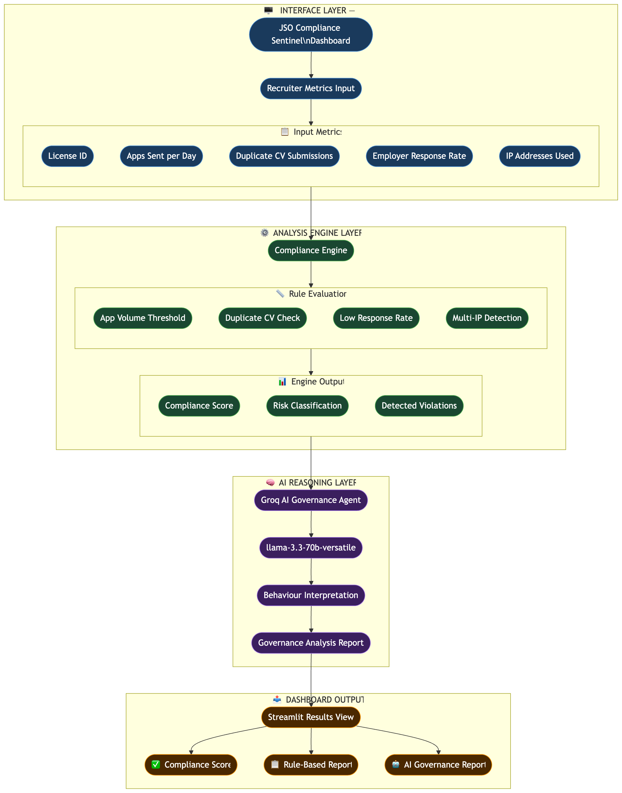

# JSO Compliance Sentinel

An **AI Licensing Governance Agent** prototype for a recruitment platform. The system monitors recruiter license usage, detects compliance violations, evaluates recruiter quality, and generates automated governance reports using a **Hybrid AI Agent Architecture**.

## Live Demo

Check out the live application here: [JSO Compliance Sentinel](https://jsocompliance.streamlit.app)

## FLOWCHART


## AI Agent Architecture

JSO Compliance Sentinel demonstrates a **Hybrid Governance Agent** with two layers:

### Layer 1: Deterministic Compliance Engine
- Rule-based compliance checks for transparency and auditing
- Evaluates 4 compliance rules:
  - **RULE_1**: High application volume (> 50 applications/day)
  - **RULE_2**: Duplicate CV submissions (> 5 duplicates)
  - **RULE_3**: Low employer response rate (< 5.0%)
  - **RULE_4**: Possible license sharing (> 3 IP addresses)
- Calculates compliance scores (0-100)
- Classifies risk levels (SAFE, WARNING, HIGH_RISK)

### Layer 2: AI Reasoning Agent (Groq LLM)
- Uses **Groq LLM (`llama-3.3-70b-versatile`)** with a structured governance prompt (`agent.py`).
- **Full context for reconciliation**: Each call includes recruiter activity metrics, rule-engine score/risk/violations, the **same rule-based narrative report** (`ComplianceResult.report`) and **numbered rule recommendations** (`ComplianceResult.recommendations`) produced by Layer 1—so the model can compare its own reasoning with deterministic outputs.
- **Two-phase reasoning**: The prompt asks the model to assess **metrics alone first** (“independent behavior & risk view”), then reconcile with rule-engine findings (“rule engine summary,” alignment vs tension).
- **Structured report sections**: Independent view → rule summary → **alignment & conflicts** (agreement, tensions, resolution guidance: rule engine remains authoritative for enforcement/scoring) → governance actions → audit notes.
- **Guardrails**: Instructions to cite only supplied data (“unknown / not provided” otherwise), avoid inventing JSO license terms/policy, and treat candidate-related data minimally (aggregate metrics only; no inferred CV/personal content).
- **SAFE bypass**: If Layer 1 classifies risk as **`SAFE`**, **the LLM is not invoked**—the dashboard shows an informational skip message (`AI_SKIPPED_SAFE_MESSAGE` in `agent.py`) instead of consuming API quota.
- **Sizing**: Prompt targets roughly **350–550 words** of structured output; API `max_tokens` is set to **1200** for headroom.

### Workflow
```
Recruiter Activity Input
    ↓
Rule-Based Compliance Engine (Layer 1)
    ↓
ComplianceResult (score, risk, violations, report, recommendations)
    ↓
    ├─ SAFE ──► Skip Groq LLM · show skip message (Layer 2 idle)
    │
    └─ WARNING / HIGH_RISK ──► Groq LLM Agent (Layer 2)
                ↓
        Compliance Intelligence Report (structured markdown)
                ↓
            Dashboard Display
```

## Project Structure

```
.
├── models.py                  # Core data models
├── compliance_engine.py       # Layer 1: Rule-based compliance engine
├── agent.py                   # Layer 2: AI reasoning agent (Groq LLM)
├── ai_report.py              # Report generation utilities
├── mock_data.py              # Mock data generator
├── app.py                    # Streamlit dashboard UI
├── requirements.txt          # Python dependencies
└── README.md                 # This file
```

## Setup

### 1. Install Dependencies

```bash
pip install -r requirements.txt
```

### 2. Configure Groq API Key

Layer 2 calls Groq only for **WARNING** and **HIGH_RISK** results (see workflow). Get a free API key from [Groq Console](https://console.groq.com/).

**Set the environment variable:**

```bash
export GROQ_API_KEY=your_key_here
```

**Or on Windows:**

```cmd
set GROQ_API_KEY=your_key_here
```

**Notes:**
- Without the API key, **WARNING** and **HIGH_RISK** runs cannot call Layer 2—the UI shows that the AI agent is not configured. **SAFE** runs never call the LLM anyway (see Layer 2 above).
- Rule-based analysis (Layer 1) always runs regardless of API key configuration.

### 3. Run the Application Locally

```bash
streamlit run app.py
```

The dashboard will open in your browser at `http://localhost:8501`.

## Usage

1. **Load Mock Data (Optional)**: Select a pre-configured recruiter example from the dropdown
2. **Enter Recruiter Metrics**: Input the five required metrics or use loaded mock data
3. **Run Compliance Analysis**: Click the button to analyze
4. **View Results**:
   - Compliance score and risk level
   - Rule-based compliance report
   - Rule engine recommendations
   - **AI Compliance Agent Analysis** — For **SAFE**, an info message explains that the LLM was skipped; for **WARNING / HIGH_RISK**, a structured report appears when **`GROQ_API_KEY`** is set (Streamlit secrets `GROQ_API_KEY` are also supported)

## Data Models

### RecruiterMetrics
Represents recruiter activity metrics for compliance analysis.

**Fields:**
- `license_id` (str): Non-empty license identifier
- `applications_sent_today` (int): Non-negative count of applications
- `duplicate_cvs` (int): Non-negative count of duplicate submissions
- `employer_response_rate` (float): Response rate percentage (0.0-100.0)
- `ip_addresses_used` (int): Positive count of IP addresses (≥1)

### Violation
Represents a compliance rule violation.

**Fields:**
- `rule_id` (str): Non-empty rule identifier (e.g., "RULE_1")
- `description` (str): Non-empty violation description
- `penalty_points` (int): Positive penalty value

### RiskLevel
Enum for risk classification.

**Values:**
- `SAFE`: Compliance score ≥ 80
- `WARNING`: Compliance score 50-79
- `HIGH_RISK`: Compliance score < 50

### ComplianceResult
Complete compliance analysis result.

**Fields:**
- `metrics` (RecruiterMetrics): Input metrics
- `violations` (list[Violation]): Detected violations
- `compliance_score` (int): Score 0-100
- `risk_level` (RiskLevel): Risk classification
- `report` (str): Human-readable report
- `recommendations` (list[str]): Actionable recommendations

## Testing

The application is ready to use. No test suite is included in this minimal prototype.

To verify the application works:

```bash
streamlit run app.py
```

Then test with the provided mock data examples.

## Key Features

✅ **Hybrid AI Architecture**: Combines deterministic rules with LLM reasoning  
✅ **Real-time Compliance Monitoring**: Instant analysis of recruiter behavior  
✅ **Risk Classification**: Automatic categorization (SAFE, WARNING, HIGH_RISK)  
✅ **AI-Powered Insights**: Natural language governance recommendations  
✅ **Mock Data**: 10 pre-configured test scenarios  
✅ **Performance**: < 100ms analysis time (rule engine)  
✅ **Clean UI**: Color-coded Streamlit dashboard  
✅ **SAFE optimization**: No Groq API call when risk is **SAFE**  
✅ **Conflict-aware AI layer**: Independent assessment plus explicit alignment/conflict sections vs the rule engine  
✅ **Fallback Mode**: WARNING/HIGH_RISK still need an API key for Layer 2; Layer 1 always runs

## Technology Stack

- **Python 3.10+**: Core language
- **Streamlit**: Dashboard UI framework
- **Groq SDK**: LLM API integration
- **llama-3.3-70b-versatile**: AI reasoning model

## License & Compliance

This is a prototype demonstration system. For production use:
- Add authentication and authorization
- Implement audit logging
- Add data encryption
- Comply with data protection regulations
- Add rate limiting for API calls
- Implement proper error handling and monitoring
